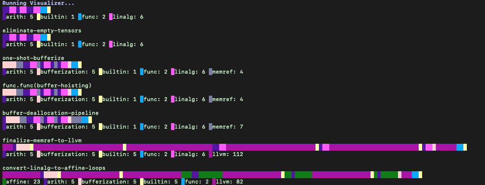
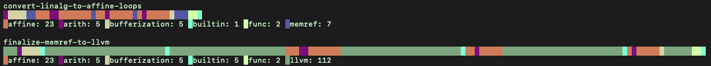

# Visualize-Opt

visualize-opt adds visualization passes between each pass in a given pass-pipeline. It can be useful to quickly see how different passes and orders passes change the dialects and number of instructions.


The example above does bufferization, lowers memrefs to llvm, then lowers linalg operations to affine loops. Using the pass helps to see that the order of the last 2 steps is important, since the example below ends up with a lot of extra instructions.

<details>
  <summary>What to run to get the image</summary>
  build/bin/visualize-opt --pass-pipeline="builtin.module(eliminate-empty-tensors,one-shot-bufferize,func.func(buffer-hoisting),buffer-deallocation-pipeline,finalize-memref-to-llvm,convert-linalg-to-affine-loops)" mlir/test/Examples/myExamples/fc_relu.mlir
</details>

## Setup:
   
   visualize-opt just requires you to build mlir along with llvm.

   After CMake it can be built with:
```
$ ninja visualize-opt
```
## How to Use

   It works identical to mlir-opt, except if you specify a pass pipeline. When specifying the pass without a pipeline, you can still insert the pass normally with `--test-dialect-counts`

   I added a couple small mlir programs to visualize in mlir/test/Examples/myExamples

## Source Code

[Visualization Pass](../../test/lib/IR/TestDialectCounts.cpp)

[visualize-opt](visualize-opt.cpp)

